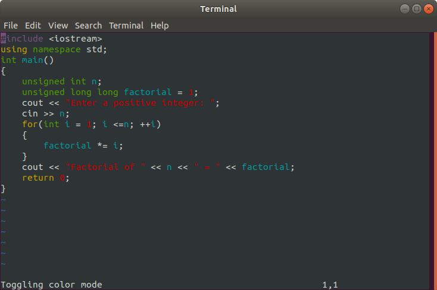
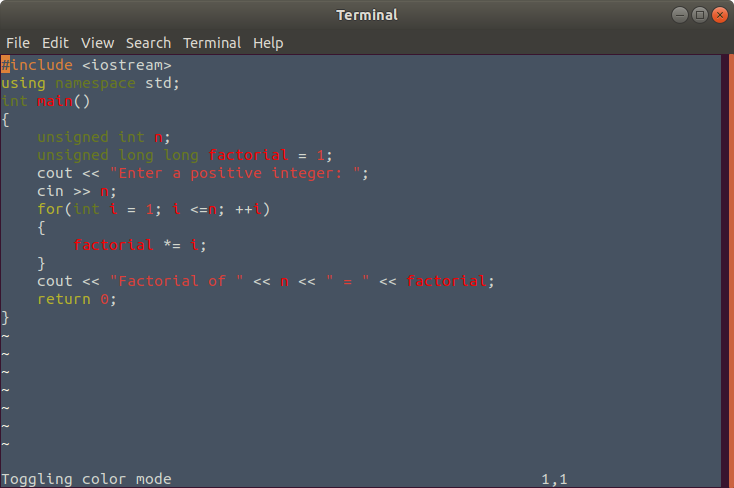

# vm
CS246E final project (executable only)

A text editor for Linux written in C++ based on the vm editor. It supports the following:
+ page navigation using commands
+ command, insert, and replace mode
+ saving and quitting
+ unlimited number of undoes
+ basic searching (no regexes)
+ repetition of previous commands
+ multipliers in front of commands
+ line wrapping
+ syntax highlighting
+ macros
+ custom themes

The full list of supported commands is: 

a b cc c[any motion] dd d[any motion] f h i j k l n o p q r s u w x yy y[any motion] A F I J N O P R S X ^ $ 0 . ; / ? % @ ^b ^d ^f ^g ^u :w :q :wq :q! :r :0 :$ :line-number

To turn on color mode and syntax highlighting, enter the command `:color`.

To use custom themes, run the executable with a .color file as the second command line argument (does not work on PuTTY).

To create a .color file, enter 7 lines of space-separated RGB values in the following order:
1. KEYWORDS
2. STRING AND NUMERIC LITERALS
3. TYPES
4. COMMENTS
5. PREPROCESSOR DIRECTIVES
6. IDENTIFIERS
7. BACKGROUND

Due to University of Waterloo policies, I am prohibited from publishing the source code for this project. However, I have included the executable and some screenshots:

